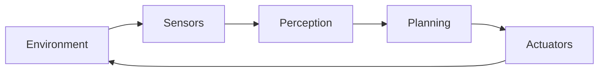

# Obsidian 格式规范

本文件规定所有产物（课次笔记、知识卡片、索引页）必须遵守的格式约定。目标是让笔记在 Obsidian 里**读起来舒服、层级清晰、可被自动化查询**。

---

## 1. 标题层级

| 层级 | 用途 | 约束 |
|---|---|---|
| `#` H1 | 文档标题 | **全篇唯一**，只出现在文件开头 |
| `##` H2 | 章节 | 用数字编号：`## 1. ...`、`## 2. ...` |
| `###` H3 | 小节 | 用二级编号：`### 1.1 ...`、`### 1.2 ...` |
| `####` H4 | 更细的分组 | 仅在必要时使用 |

**硬性规则**：

- **禁止用加粗文本充当标题**。下列写法一律禁止：
  - ✗ `**2.1 世界模型（p.7）**`
  - ✓ `### 2.1 World Model（课件 p.7–8）`
- **每个 H2 只要有 2 个以上可分离的要点，就必须用 H3 细分**。一个 H2 底下塞 8000 字是不允许的。
- 层级必须连续：出现 `###` 之前必须已有 `##`。
- H2 编号与 `lesson_order` 无关，只表示本章节的顺序。

---

## 2. 中英术语约定

**专业术语保留英文**，首次出现时给出中文解释，之后直接使用英文：

```markdown
第一步是表示世界，这就是 **World Model**（世界模型）。
后面所有讨论都建立在 World Model 之上，不再重复中文译名。
```

**应当保留英文的类别**：

| 类别 | 例子 |
|---|---|
| 领域概念 | World Model、State Estimation、Planning、Control、Sensor Fusion |
| 算法与模型 | CNN、R-CNN、YOLO、DETR、Transformer、Kalman Filter |
| 硬件与协议 | LiDAR、IMU、Radar、ROS、DDS、GPU |
| 任务名称 | Object Detection、Semantic Segmentation、SLAM |
| 属性与术语 | embodied、active、situated、ego-vision |

**应当用中文的**：连接词、解释性语句、标题中的说明部分、章节名。

**项目建议**：每篇课次笔记末尾附一张**术语表**（中英对照 + 一句话），方便复习与检索。

---

## 3. Callout（提示框）

用 callout 突出关键信息，不要用加粗堆砌：

| 类型 | 用途 | 示例场景 |
|---|---|---|
| `> [!abstract]` | 摘要 / 本节要解决什么 | 笔记开头 |
| `> [!tip]` | 技巧、类比、记忆方法 | 「可以把它类比成…」 |
| `> [!note]` | 补充说明 | 「名字的误导：ROS 不是操作系统」 |
| `> [!warning]` | 易错点、常见误解 | 「robotics 的 model ≠ ML 的 model」 |
| `> [!example]` | 例子 | 「以 Waymo 为例…」 |
| `> [!important]` | 必须记住的结论 | 「整门课都在往这个循环里填东西」 |
| `> [!question]-` | 自测题（**默认折叠**） | 复习区 |

```markdown
> [!warning] 一个必须分清的同名术语
> Robotics 里的 model 指对物理系统的表示；ML 里的 model 指算法及其参数。
```

**可折叠**：标题后加 `-` 表示默认折叠（`> [!question]-`），加 `+` 表示默认展开。

---

## 4. 图与公式

**流程、结构、循环关系用 mermaid**，不要用纯文字描述拓扑：

````markdown

````

**数学用 LaTeX**：

- 行内：`$P(s_t, a_t) = s_{t+1}$` → $P(s_t, a_t) = s_{t+1}$
- 独立块：`$$ ... $$`

**高亮**：`==关键结论==` 用于需要一眼看到的短句，不要整段高亮。

---

## 5. 双链与嵌入

**内链**（同一 vault 内）：用 wikilink，Obsidian 会自动跟随重命名。

```markdown
[[World Model]]                        链接到卡片
[[World Model|世界模型]]                自定义显示文本
[[L02 - Embodied AI System Overview]]  链接到课次笔记
```

**外链**：用标准 Markdown 链接 `[文本](https://...)`。

**嵌入课件原页**（强烈推荐，用于需要对照原文的地方）：

```markdown
![[AIAA 4220 L2.pdf#page=10]]          嵌入 PDF 第 10 页
![[AIAA 4220 L2.pdf#page=10|400]]      指定显示宽度
![[World Model#定义]]                   嵌入另一篇笔记的某一节
```

**规范**：

- 笔记里提到某个概念时，**在该处内联卡片链接**（不要只在文末列「本节知识卡片」）；
- 引用课件原文时优先用**嵌入 PDF 页**，而不是把课件文字抄进笔记；
- 不得链接到不存在的文件（会形成断链）。

---

## 6. 标签体系

分层标签用于多维度检索（一张卡可以有多个标签）：

```yaml
tags:
  - concept/embodied-ai        # 领域
  - concept/perception         # 环节 / 主题
  - concept/geometry           # 交叉主题
```

**命名约定**：

| 前缀 | 用途 | 例子 |
|---|---|---|
| `concept/` | 知识卡片所属领域 | `concept/deep-learning`、`concept/robotics` |
| `course/` | 课程归属 | `course/AIAA4220` |
| `type/` | 内容类型 | `type/summary`、`type/cheatsheet` |

标签只能包含字母、数字、下划线、连字符和斜杠，且**数字不能作为首字符**。

---

## 7. Properties（frontmatter）

```yaml
---
type: lesson                  # lesson | concept | index
course_id: AIAA4220
lesson_id: L02
lesson_order: 2
title: Embodied AI System Overview
aliases:                      # 别名，用于链接建议与检索
  - L02 具身 AI 系统概览
tags:
  - course/AIAA4220
status: reviewed              # draft | filling | filled | reviewed | needs_review
vf: true
vf_version: course-cn-v2
vf_status: pristine           # pristine | user_modified | locked
---
```

**关键约束**：工具链（`scripts/course-manifest.py`）只解析**单行** `key: value`，因此 `type`、`lesson_id`、`status`、`vf_status` 等关键字段**必须写成单行标量**，不要写成多行 YAML。

---

## 8. 禁止出现的元素

| 禁止 | 原因 | 替代做法 |
|---|---|---|
| `●` `○` `■` `▪` 等项目符号 | 抄自课件 PDF，渲染后层次混乱 | 用 Markdown 列表 `-` |
| `**1.1 标题**` 伪标题 | 破坏大纲层级与 Obsidian 大纲面板 | 用 `### 1.1 标题` |
| `（p.13）（p.71–74）` 逐句页码 | 引用密度过高，阅读体验差 | 章节级标注「课件 p.13–18」+ 文末来源 |
| “课件未展开”“课件未覆盖”“本课程未提供” | 审计口吻，不是笔记语言 | 如实简述；确需回看时写「建议对照课件 p.17」 |
| 整段抄录课件英文原文 | 那是课件的工作，不是笔记 | 用自己的话讲；必要时用嵌入 PDF 页 |
| 未标注的外部知识伪装成课件结论 | 事实层不可妥协 | 补充内容用自然语言说明来源（如「值得一提的背景是…」） |

---

## 9. 文件命名

| 产物 | 约定 | 例子 |
|---|---|---|
| 课次笔记 | `Lxx - <English Title>.md` | `L02 - Embodied AI System Overview.md` |
| 知识卡片 | `<English Concept Name>.md` | `World Model.md`、`Kalman Filter.md` |
| 课程索引 | 固定 `00. 课程索引.md` | — |
| 知识库索引 | 固定 `_index.md` | — |
| 临时文件 | `{目标名}.tmp` | `L02 - ... .md.tmp` |

---

## 10. 一份合格笔记的自检

- [ ] H1 唯一；没有伪标题；每个 H2 若有多个要点就有 H3 细分
- [ ] 开头有「本节要解决什么」的摘要 callout 与知识地图
- [ ] 正文没有逐句页码；每节标了课件覆盖范围
- [ ] 专业术语保留英文，且有术语表
- [ ] 关键处用了 callout / mermaid / LaTeX，而不是加粗堆砌
- [ ] 提到概念处内联了卡片链接；没有断链
- [ ] 没有课件项目符号、没有审计式声明
- [ ] 合上笔记能回答「是什么、解决什么、怎么工作、何时失效」
